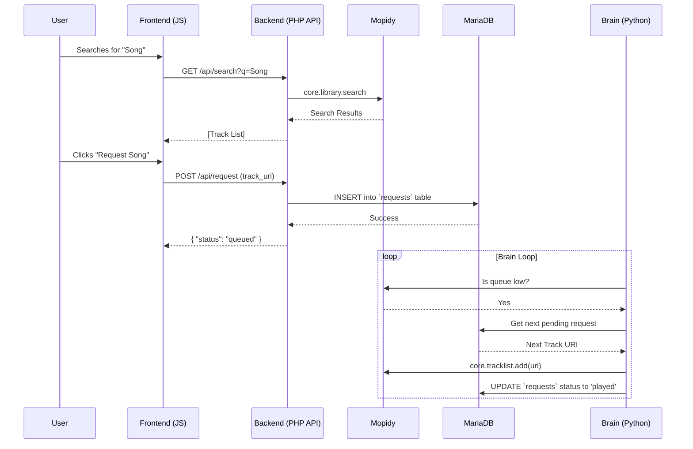

# DJ Brain Architecture Overview

This document provides a high-level overview of the DJ Brain project's architecture, development patterns, and future direction. It is intended to be a technical supplement to the `README.md` and `project_plan.md`.

## 1. Core Philosophy

The system is designed around a **Service-Oriented Architecture (SOA)**, orchestrated by Docker. Each core component (Music Server, Database, API, AI Brain) is an independent service that communicates over the network.

This approach provides:
- **Modularity:** Each service can be updated, replaced, or debugged independently.
- **Scalability:** While not a primary goal for a single-instance jukebox, it's possible to run services on different machines.
- **Technology Flexibility:** We can use the best language for the job (Python for AI, PHP for web API, etc.).

### Design Inspiration & Differentiation

Projects like the ["Mopidy Hackerspace Jukebox"](https://www.hackster.io/news/the-mopidy-hackerspace-jukebox-6c7e7835a565), the ["Kyan Office Jukebox"](https://kyan.com/news/building-our-own-office-jukebox-using-mopidy-nodejs-and-react), and the jukebox mode in [Navidrome](https://www.navidrome.org/docs/usage/jukebox/) demonstrate successful jukeboxes built on a monolithic design. They validate features like real-time updates, voting, and user cooldowns, which are part of DJ Brain's long-term roadmap.

DJ Brain's key differentiator is its decoupled, service-oriented architecture. By separating the request queue (in MariaDB) from the music player's internal tracklist, we enable persistence, priority/paid requests, and intelligent AI-driven queue management—features not easily achievable in monolithic designs.

## 3. Deployment Models

The architecture supports two primary deployment models:

### A) All-in-One Server

This is the most common setup. The host machine (e.g., a mini-PC) runs all Docker services and is also connected directly to the main sound system. The Mopidy container is configured to use the host's sound card for audio output. This is perfect for a single-room venue.

### B) Central Server + Remote Players

For multi-room audio, a central server runs the core services, while one or more lightweight devices (like Raspberry Pis) act as network audio players in different zones. Mopidy streams the audio to these remote players.
This model's key benefit is that it requires only one central music collection, saving significant storage space and simplifying library management.

---

## 2. Service Interaction

The flow of a typical user request looks like this:

## 3. Project Review & Improvements

### What's Great

- **Clear Vision:** The goal is well-defined and compelling.
- **Solid Tech Stack:** The chosen technologies (Docker, Mopidy, PHP, Python) are standard, well-documented, and fit their purpose perfectly.
- **Excellent Documentation Start:** The `README.md`, `CONTRIBUTING.md`, and `project_plan.md` provide a strong foundation for collaboration.

### Areas for Improvement & Clarification

1.  **Serving the Frontend:** The current `docker-compose.yml` maps the PHP API to `./src/api`, but it's unclear how the HTML/JS frontend in `./src/frontend` will be served.
    *   **Recommendation:** Modify the `php_backend` service to serve both. We can mount the frontend files into a subdirectory of the web root. This keeps the setup simple with a single web server.
 
2.  **Configuration Management:** The `docker-compose.yml` has hardcoded passwords and paths. The `README.md` correctly instructs users to create a `.env` file, but the supporting files are missing.
    *   **Recommendation:** Create a `.env.example` file and update `docker-compose.yml` to use environment variables. This is a critical best practice for security and usability.

3.  **Database Schema:** The `project_plan.md` mentions the `requests` table but doesn't define its structure.
    *   **Recommendation:** Define the `CREATE TABLE` statement. This removes ambiguity for the backend developer. A good place for this would be in a `database/schema.sql` file that could be used for initialization.

4.  **Redundant Plan:** The project contains both `project_plan.md` and `project_plan2.md`.
    *   **Recommendation:** Consolidate all planning into `project_plan.md` and delete `project_plan2.md` to avoid confusion for new contributors.

### Missing Pieces

- **AI "Brain" Service:** The `docker-compose.yml` is missing the placeholder for the Python "Brain" service planned for Phase 2. Adding it now (even commented out) makes the blueprint more complete.
- **Initial Database Schema:** There is no SQL file to define the initial database tables.

## 4. Future Versions (Beyond the Roadmap)

Once the core roadmap is complete, here are some potential future enhancements:

- **Advanced AI DJ Features:**
    -   **Genre/Mood Transitions:** AI logic to smoothly transition between genres (e.g., play a cross-over track).
    -   **User Profile Learning:** The AI could learn the preferences of frequent users and tailor its filler tracks accordingly.
    -   **"Do Not Play" Lists:** Venue owners can create lists of songs or artists to exclude from requests and AI selections.

- **Enhanced User Interaction:**
    -   **Real-time Queue View:** The frontend could use WebSockets to show the upcoming tracklist in real-time.
    -   **Song Dedications:** Allow users to attach a short message to their request.
    -   **Social Voting:** Users can vote on songs in the queue to influence their position.

- **Administration & Operations:**
    -   **Admin Dashboard:** A dedicated web UI for the owner to view request history, manage users, see revenue, configure the AI Brain's behavior, and manage site settings like themes.
    -   **Music Discovery:** Integrate with services like MusicBrainz or Spotify's API to automatically fetch richer metadata (album art, BPM, mood tags) for the local music library.
    -   **Theming Engine:** Allow operators to change the look and feel of the jukebox frontend via the Admin Dashboard. This could range from simple color changes (e.g., Neon, Holiday, Seasonal) to full template overrides.

- **Beyond Audio: Video & Karaoke**
    -   While Mopidy is audio-only, the service-oriented architecture allows for future expansion. A new "video player" service (using a backend like `mpv`) could be added alongside Mopidy to handle video or karaoke requests without disrupting the existing audio functionality. The core database and request logic could be extended to support different media types.

---

## 5. Commercial Strategy: Open Core

The project is designed to support a commercial ecosystem through an "Open Core" model, allowing third parties to sell installations and offering optional paid upgrades.

### Licensing for Commercial Sale

The project's MIT License is permissive and explicitly allows anyone to package the DJ Brain software with hardware and sell it as a finished installation to customers. This encourages a community of value-added resellers.

### Pro Features & Tiered Functionality

Advanced features can be offered as a "Pro" version, managed via license keys that grant access to private Docker images. This creates a tiered system:

1.  **Standard (Free):** The baseline open-source version, capable of running on low-power hardware like a Raspberry Pi 4. The AI provides basic request queuing and random track selection.
2.  **Enhanced (Free):** An optional mode within the open-source version for users with more powerful servers. It can be enabled via a configuration flag to unlock more complex AI logic, such as BPM and mood matching.
3.  **Pro (Paid):** A separate, proprietary set of services that replace or augment the standard ones. This tier would include:
    -   The most advanced AI engine (e.g., for learning user preferences).
    -   Video and Karaoke playback functionality.
    -   A dedicated administration dashboard.

This model ensures the core project remains free and open-source, while creating a path for sustainable development and advanced, commercially-supported features.

---

This review has been documented here. The next step is to apply the recommended improvements.